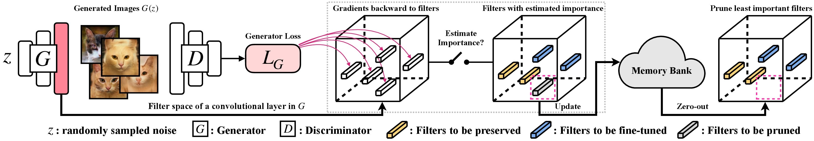

<h1 align='center' style="text-align:center; font-weight:bold; font-size:2.0em;letter-spacing:2.0px;">
                Exploring Incompatible Knowledge Transfer<br>in Few-shot Image Generation</h1>
<p align='center' style="text-align:center;font-size:1.25em;">
    <a href="https://scholar.google.com/citations?user=kQA0x9UAAAAJ&hl=en" target="_blank" style="text-decoration: none;">Yunqing Zhao<sup>1</sup></a>&nbsp;,&nbsp;
    <a href="https://duchao0726.github.io/" target="_blank" style="text-decoration: none;">Chao Du<sup>2</sup></a>&nbsp;,&nbsp;
    <a href="https://miladabd.github.io/" target="_blank" style="text-decoration: none;">Milad Abdollahzadeh<sup>1</sup></a>&nbsp;,&nbsp;
    <a href="https://p2333.github.io/" target="_blank" style="text-decoration: none;">Tianyu Pang<sup>2</sup></a></br>
    <a href="https://linmin.me/" target="_blank" style="text-decoration: none;">Min Lin<sup>2</sup></a>&nbsp;,&nbsp;
    <a href="https://yanshuicheng.ai/" target="_blank" style="text-decoration: none;">Shuicheng Yan<sup>2</sup></a>&nbsp;,&nbsp;
    <a href="https://sites.google.com/site/mancheung0407/" target="_blank" style="text-decoration: none;">Ngai&#8209;Man Cheung<sup>1</sup></a></br>
</p>
<p align='center' style="text-align:center;font-size:1.25em;">
<sup>1</sup>Singapore University of Technology and Design (SUTD)</br>
<sup>2</sup>Sea AI Lab (SAIL), Singapore<br/>
</p>

<p align='center';>
<b>
<em>The IEEE/CVF Conference on Computer Vision and Pattern Recognition (CVPR) 2023;</em> <br>
<em>Vancouver Convention Center, Vancouver, British Columbia, Canada.</em>
</b>
</p>

<p align='left' style="text-align:left;font-size:1.3em;">
<b>
    [<a href="https://yunqing-me.github.io/RICK/" target="_blank" style="text-decoration: none;">Project Page</a>]&nbsp;&nbsp;
    [<a href="https://cvpr2023.thecvf.com/media/PosterPDFs/CVPR%202023/23031.png?t=1685376860.4000738" target="_blank" style="text-decoration: none;">Poster</a>]&nbsp;&nbsp;
    [<a href="https://cvpr2023.thecvf.com/media/cvpr-2023/Slides/23031_t6s1F8r.pdf" target="_blank" style="text-decoration: none;">Slides</a>]&nbsp;&nbsp;
    [<a href="https://arxiv.org/abs/2304.07574" target="_blank" style="text-decoration: none;">Paper</a>]
    <!-- /&nbsp; -->
    <!-- <a href="https://recorder-v3.slideslive.com/?share=74947&s=c88e53c5-a3c2-46c9-9719-092b74eca0c2" target="_blank" style="text-decoration: none;">Talk</a>&nbsp; -->
</b>
</p>



# Installation:
- Platform: Linux
- NVIDIA A100 PCIe 40GB, CuDNN 11.4
- lmdb, tqdm, wandb

A suitable conda environment named `fsig` can be created and activated with:

```
conda env create -f environment.yml -n fsig
conda activate fsig
```


# Prepare the datasets

## Step 1. 
Prepare the few-shot training dataset using lmdb format

For example, download the 10-shot target set, `Babies` ([Link](https://drive.google.com/file/d/1P8JMLq2Kk61MbEZDgwytqXxfrhG-NqcR/view?usp=sharing)) and `AFHQ-Cat`([Link](https://drive.google.com/file/d/1zgacEE0jiiDxttbK81fk6miY_4Ithhw-/view?usp=sharing)), and organize your directory as follows:

~~~
10-shot-{babies/afhq_cat}
└── images		
    └── image-1.png
    └── image-2.png
    └── ...
    └── image-10.png
~~~

Then, transform to lmdb format:

`python prepare_data.py --input_path [your_data_path_of_{babies/afhq_cat}] --output_path ./_processed_train/[your_lmdb_data_path_of_{babies/afhq_cat}]`

## Step 2. 
Prepare the entire target dataset for evaluation

For example, download the entire dataset, `Babies`([Link](https://drive.google.com/file/d/1xBpBRmPRoVXsWerv_zx4kQ4nDQUOsqu_/view?usp=share_link)) and `AFHQ-Cat`([Link](https://drive.google.com/file/d/1_-cDkzqz3LlotXSYMBXZLterSQe4fR7S/view?usp=share_link)), and organize your directory as follows:

~~~
entire-{babies/afhq_cat}
└── images		
    └── image-1.png
    └── image-2.png
    └── ...
    └── image-n.png
~~~

Then, transform to lmdb format for evaluation

`python prepare_data.py --input_path [your_data_path_of_entire_{babies/afhq_cat}] --output_path ./_processed_test/[your_lmdb_data_path_of_entire_{babies/afhq_cat}]`

## Step 3. 
Download the GAN model pretrained on FFHQ from [here](https://drive.google.com/file/d/1TQ_6x74RPQf03mSjtqUijM4MZEMyn7HI/view). Then, save it to `./_pretrained/style_gan_source_ffhq.pt`.


# Training and Evaluation

FFHQ -> Babies:
```
CUDA_VISIBLE_DEVICES=0 \
 python _intra_lpips_train_dynamic_update_prune.py \
 --exp stylegan_lpips_dynamic_prune_ffhq_babies --data_path babies --n_sample_train 10 \
 --iter 1750 --batch 2 --num_fisher_img 5 \
 --fisher_freq 50 --warmup_iter 250 --fisher_quantile 40 \ --prune_quantile 0.1 \
 --ckpt_source style_gan_source_ffhq.pt --source_key ffhq \
 --store_samples --samples_freq 50 \
 --eval_in_training --eval_in_training_freq 50 --n_sample_test 5000 --method rick \
 --wandb --wandb_project_name stylegan_lpips_ours_babies --wandb_run_name tmp
```

FFHQ -> AFHQ-Cat:
```
CUDA_VISIBLE_DEVICES=4 \
 python _intra_lpips_train_dynamic_update_prune.py.py \
 --exp stylegan_lpips_dynamic_prune_ffhq-afhq_cat --data_path afhq_cat --n_sample_train 10 \
 --iter 2250 --batch 2 --num_fisher_img 5 \
 --fisher_freq 50 --warmup_iter 250 --fisher_quantile 85 --prune_quantile 0.075 \
 --ckpt_source style_gan_source_ffhq.pt --source_key ffhq \
 --store_samples --samples_freq 50 \
 --eval_in_training --eval_in_training_freq 50 --n_sample_test 5000 --method rick \
 --wandb --wandb_project_name stylegan_lpips_ours_afhq_cat --wandb_run_name tmp
```
The training dynamics will be actively updated in `wandb`.
# Bibtex
If you find this project useful in your research, please consider citing our paper:

```
@inproceedings{zhao2023exploring,
    title={Exploring incompatible knowledge transfer in few-shot image generation},
    author={Zhao, Yunqing and Du, Chao and Abdollahzadeh, Milad and Pang, Tianyu and Lin, Min and Yan, Shuicheng and Cheung, Ngai-Man},
    booktitle={Proceedings of the IEEE/CVF Conference on Computer Vision and Pattern Recognition},
    pages={7380--7391},
    year={2023}
}
```
Meanwhile, we also demonstrate a relevant research for few-shot image generation, via parameter-efficient and Adaptation-Aware kernel Modulation ([AdAM](https://github.com/yunqing-me/AdAM)) to fine-tune the pretrained models:

```
@inproceedings{zhao2022fewshot,
    title={Few-shot Image Generation via Adaptation-Aware Kernel Modulation},
    author={Yunqing Zhao and Keshigeyan Chandrasegaran and Milad Abdollahzadeh and Ngai-man Cheung},
    booktitle={Advances in Neural Information Processing Systems},
    editor={Alice H. Oh and Alekh Agarwal and Danielle Belgrave and Kyunghyun Cho},
    year={2022},
    url={https://openreview.net/forum?id=Z5SE9PiAO4t}
}
```
# Acknowledgement: 

We appreciate the wonderful base implementation of StyleGAN-V2 from [@rosinality](https://github.com/rosinality). We thank [@mseitzer](https://github.com/mseitzer/pytorch-fid), [@Ojha](https://github.com/utkarshojha/few-shot-gan-adaptation) and [@richzhang](https://github.com/richzhang/PerceptualSimilarity) for their implementations on FID score and intra-LPIPS.

We also thank for the useful training and evaluation tool used in this work, from [@Miaoyun](https://github.com/MiaoyunZhao/GANmemory_LifelongLearning).


